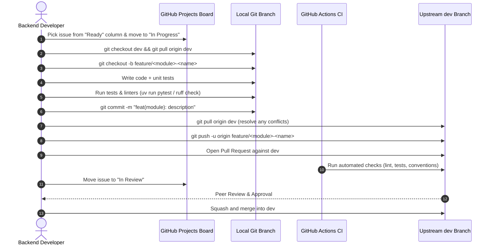

# Contributing to BRB Server (`brb-server`)

Welcome to the backend repository of **BRB (Borrow, Return, Borrow)**! This guide establishes the development workflow, coding conventions, architectural patterns, and quality standards for our backend engineering team. 

Please read this document thoroughly before opening your first pull request. The mobile application team maintains its companion guide in the client repository.

| Role | Responsibilities |
|---|---|
| **Backend Developers** | Django REST Framework API, database models, migrations, background jobs, serializers, services, and automated tests in `brb-server` |
| **Mobile Developers** | React Native + Expo mobile client, client state management, UI/UX screens, in-app polling |
| **Admin Portal Maintainers** | Django Admin customizations, moderation queues, identity verification views, audit logging |
| **Product Owner & Course Instructor** | Backlog prioritization, SRS alignment, final code reviews, and production releases to `main` (Instructor: Mr. Chris Nicole F. Piamonte) |

Project tracking and sprint boards are managed under the [pup-swe-team GitHub Organization](https://github.com/pup-swe-team).

---

## Contents

1. [Prerequisites](#1-prerequisites)
2. [First-Time Setup](#2-first-time-setup)
3. [Daily Development Workflow](#3-daily-development-workflow)
4. [Branches and Commits](#4-branches-and-commits)
5. [Code Quality and Git Hooks](#5-code-quality-and-git-hooks)
6. [Continuous Integration (CI)](#6-continuous-integration-ci)
7. [Coding Standards and BRB Architecture](#7-coding-standards-and-brb-architecture)
8. [Writing Issues and SRS Traceability](#8-writing-issues-and-srs-traceability)
9. [Definition of Ready and Done](#9-definition-of-ready-and-done)
10. [Troubleshooting](#10-troubleshooting)

---

## 1. Prerequisites

Ensure the following tools are installed on your workstation:

| Tool | Minimum Version | Verification Command | Notes |
|---|---|---|---|
| **Git** | 2.40+ | `git --version` | Configured with your PUP student/faculty email |
| **Python** | 3.12 | `python --version` | Managed via `uv` or system Python |
| **[uv](https://docs.astral.sh/uv/)** | 0.7+ (Recommended 0.12+) | `uv --version` | Ultra-fast Python package and project manager |

### Operating System & Shell Guidelines
- **Windows**: Use **Git Bash** or **PowerShell**. Avoid Command Prompt (`cmd.exe`).
- **macOS / Linux**: Use your standard POSIX terminal (`zsh` or `bash`).
- Commands throughout this guide are prefixed with `uv run`, which guarantees execution inside the managed virtual environment (`.venv`).

---

## 2. First-Time Setup

### 2.1 Clone the Repository
Clone `brb-server` and navigate into the project directory:

```bash
git clone git@github.com:pup-swe-team/brb-server.git
cd brb-server
git checkout dev
```

> [!IMPORTANT]
> Always verify you are branched off **`dev`** before starting work. `main` is reserved for stable production releases.

### 2.2 Install Dependencies with `uv`
Initialize your virtual environment and install all project and development tools:

```bash
uv sync
```

This generates `.venv` and locks dependencies in `uv.lock`.

### 2.3 Configure Local Environment
Create your local environment file by copying the template:

```bash
# Git Bash / Linux / macOS:
cp .env.example .env

# Windows PowerShell:
Copy-Item .env.example .env
```

Open `.env` and review the local development values:

| Environment Variable | Local Default | Purpose |
|---|---|---|
| `DEBUG` | `True` | Enables Django debug mode and detailed error pages |
| `SECRET_KEY` | *(Generated dev secret)* | Secret key for cryptographic signing |
| `DATABASE_URL` | `render_db_url` | Zero-configuration local database |
| `JWT_SECRET` | *(Dev JWT secret)* | Key used for signing authentication tokens |
| `ALLOWED_STUDENT_EMAIL_DOMAIN` | `iskolarngbayan.pup.edu.ph` | Validates student/alumni registration domain |
| `ALLOWED_FACULTY_EMAIL_DOMAIN` | `pup.edu.ph` | Validates faculty/staff registration domain |
| `CRON_SECRET_TOKEN` | `local-dev-cron-token-brb` | Bearer token for protected scheduled endpoints |
| `EMAIL_BACKEND` | `django.core.mail.backends.console.EmailBackend` | Dumps verification/reset emails to terminal |

> [!CAUTION]
> `.env` is ignored by Git. Never commit `.env` or paste real secrets or credentials into issues, pull requests, or chat messages.

### 2.4 Apply Database Migrations
Initialize the local database schema:

```bash
uv run python manage.py migrate
```

### 2.5 Create an Administrator Account
Create a local superuser to access the Django Admin portal:

```bash
uv run python manage.py createsuperuser
```

Provide a name and a PUP webmail address (e.g., `admin@iskolarngbayan.pup.edu.ph` or `admin@pup.edu.ph`).

### 2.6 Verify Setup and Run the Server
Run Django's system check to confirm there are no configuration issues:

```bash
uv run python manage.py check
```

Start the development server:

```bash
uv run python manage.py runserver
```

Open your browser to verify:
- **Django Admin Portal**: [http://127.0.0.1:8000/admin/](http://127.0.0.1:8000/admin/)
- **API Root / Documentation**: [http://127.0.0.1:8000/api/](http://127.0.0.1:8000/api/)

---

## 3. Daily Development Workflow

Follow this step-by-step workflow for all contributions:



1. **Pick an Issue**: Select an assigned issue from the **Ready** column on the board. Assign yourself and move it to **In Progress**.
2. **Sync and Branch**:
   ```bash
   git checkout dev
   git pull origin dev
   git checkout -b feature/order-handover-code
   ```
3. **Develop in Small Commits**: Write clean code backed by unit tests. Run the test suite frequently:
   ```bash
   uv run python manage.py test
   ```
4. **Pre-Push Quality Check**: Format and lint your code:
   ```bash
   uv run ruff check .
   uv run ruff format .
   ```
5. **Rebase or Pull Upstream Changes**:
   ```bash
   git checkout dev
   git pull origin dev
   git checkout feature/order-handover-code
   git merge dev
   uv run python manage.py test
   ```
6. **Push and Open a PR**:
   ```bash
   git push -u origin feature/order-handover-code
   ```
   Open a PR targeting the **`dev`** branch. In the PR description, link the issue using `Closes #XX`.
7. **Peer Review**: Request a review from at least one backend teammate. Address comments with new commits.
8. **Squash and Merge**: Once approved and CI is green, the PR is **squash-merged** into `dev`. Delete the remote branch afterwards.

---

## 4. Branches and Commits

### 4.1 Branch Naming Conventions
Branch names must be lowercase, hyphen-separated, and prefixed by category and module:

| Branch Pattern | Purpose | Example |
|---|---|---|
| `main` | Production release branch. Direct commits strictly prohibited. | `main` |
| `dev` | Active integration branch. Target of all PRs. Direct commits strictly prohibited. | `dev` |
| `feature/<module>-<desc>` | New feature development | `feature/auth-pup-webmail` |
| `bugfix/<module>-<desc>` | Bug fix for code on `dev` | `bugfix/orders-code-expiry` |
| `hotfix/<module>-<desc>` | Critical fix for code on `main` | `hotfix/auth-token-invalidation` |
| `refactor/<module>-<desc>`| Code restructuring without behavior changes | `refactor/listings-querysets` |
| `test/<module>-<desc>`    | Test coverage improvements | `test/disputes-case-flow` |

### 4.2 Conventional Commits
All commit messages and PR titles must adhere to the **Conventional Commits** specification:

```
<type>(<scope>): <description>
```

#### Allowed Types
- **`feat`**: A new feature or API capability
- **`fix`**: A bug fix
- **`docs`**: Documentation updates only
- **`style`**: Formatting, whitespace, or linting fixes without code behavior changes
- **`refactor`**: Code reorganization that neither fixes a bug nor adds a feature
- **`perf`**: A performance improvement
- **`test`**: Adding, updating, or fixing automated tests
- **`chore`**: Build tools, dependency bumps, or repository configuration

#### Scopes (Tailored to BRB Domains)
Use the scope corresponding to the functional domain:
- `auth`: PUP webmail validation, registration, login, JWT issuance, password reset
- `users`: Profiles, affiliations, deactivation, role switching
- `verify`: Identity document upload, verification review, consent management
- `listings`: Resource posting, categories, search, filters, availability dates
- `orders`: Borrow requests, approvals, cancellation, active orders, completions
- `codes`: Handover authentication codes, return authentication codes, rate limiting
- `disputes`: Damage reporting, missing parts, dispute cases, OSS/Campus Security escalation
- `chat`: One-to-one messaging, order-linked chat history, user blocking
- `notifications`: In-app event notifications, notification preferences, email delivery
- `reports`: Content/user reporting, 30-day auto-flagging, admin report queue
- `admin`: Admin dashboard, configuration parameters, pickup locations, metrics
- `audit`: Read-only administrator audit logging

#### Examples
- `feat(auth): validate student and faculty pup webmail domains`
- `fix(codes): prevent reused return codes after order completion`
- `test(orders): add unit tests for overlapping borrowing dates`
- `refactor(listings): extract availability filter into service layer`

---

## 5. Code Quality and Git Hooks

We use **Ruff** for high-speed Python linting and code formatting, alongside **pre-commit** hooks.

### 5.1 Ruff Linting and Formatting
Before committing, ensure your code complies with project formatting and lint rules:

```bash
# Check for lint issues and import sorting:
uv run ruff check .

# Automatically fix lint issues where possible:
uv run ruff check --fix .

# Format all files according to PEP 8 standards:
uv run ruff format .
```

### 5.2 Pre-Commit Hooks
Install pre-commit hooks to automate checks before each commit:

```bash
uv run pre-commit install
```

When installed, hooks verify:
1. No sensitive secrets or private keys in the diff (`detect-private-key`)
2. Valid YAML, JSON, and TOML syntax
3. No stray merge markers or large files
4. PEP 8 compliance and formatting (`ruff`, `ruff-format`)
5. Conventional commit message format (`conventional-pre-commit`)
6. Direct commits to `main` and `dev` are blocked (`no-commit-to-branch`)

> [!CAUTION]
> **Never bypass hooks using `git commit --no-verify`.** Skipping hooks locally will only result in CI failure when the PR is submitted.

---

## 6. Continuous Integration (CI)

Every pull request targeting `dev` triggers GitHub Actions workflows to ensure stability:

| Workflow | Trigger | Checks Performed |
|---|---|---|
| **Lint & Style** | Every PR and push to `dev` | Executes `ruff check` and `ruff format --check` across the entire codebase |
| **Test Suite** | Every PR and push to `dev` | Runs full automated test suite with coverage reporting |
| **PR Conventions** | Every PR | Validates PR title follows Conventional Commits and branch naming conventions |
| **Security Audit** | Every PR | Scans dependencies for known CVEs |

> [!IMPORTANT]
> **No Red Checks Rule**: PRs cannot be merged if any CI status check is failing. If a check fails, inspect the GitHub Actions run logs, replicate the failure locally, and push the fix to your branch.

---

## 7. Coding Standards and BRB Architecture

To maintain clarity, scalability, and maintainability across the team, all backend code must conform to the architectural guidelines below.

### 7.1 Django REST Framework Architecture
Organize features by modular Django apps:

```
brb_server/
├── brb_server/              # Project settings, root urls, WSGI/ASGI
├── apps/
│   ├── authentication/     # Webmail validation, JWT auth, password resets
│   ├── users/              # User profiles, identity verification, affiliations
│   ├── listings/           # Items, categories, availability calendar, search
│   ├── orders/             # Order lifecycle, scheduling, borrowing limits
│   ├── codes/              # Handover & return OTP generation and validation
│   ├── chat/               # 1-to-1 messaging, message history, blocking rules
│   ├── reviews/            # Mutual 5-star ratings and written reviews
│   ├── reports/            # User/listing reports, dispute documentation
│   └── audit/              # Read-only admin activity and document access logs
```

#### Layered Responsibilities
- **`models.py`**: Clean database schemas with explicit constraints, field validations, and indexes. Keep business logic minimal.
- **`serializers.py`**: Validate incoming request payloads and serialize outgoing responses. Keep serializers focused on data translation.
- **`services.py` / `selectors.py`**: Encapsulate core business logic, complex database queries, atomic transactions, and transitions here.
- **`views.py` / `viewsets.py`**: Keep views thin. Views must only authenticate, check permissions, invoke services/selectors, and return standard HTTP responses.

---

### 7.2 Non-Negotiable BRB Domain Rules (SRS Compliance)

#### 1. PUP Webmail Domain Validation (FR1, NFR 4.2)
- Registrations are strictly restricted to PUP webmail addresses:
  - Students and Alumni: `@iskolarngbayan.pup.edu.ph`
  - Faculty and Staff: `@pup.edu.ph`
- All other domains must be rejected with a user-friendly error message.

#### 2. Dual-Role Permission Checks (FR4, FR5, NFR 4.2)
- A single account can act as both **Borrower** and **Lender**.
- **Rule**: Never evaluate permissions based on which UI dashboard view is currently open on the client. Validate the user's granted permissions and resource ownership on **every** backend endpoint.

#### 3. Identity Verification Privacy (FR3, NFR 4.2)
- ID pictures and supporting documents submitted during verification are strictly confidential.
- Stored securely and encrypted at rest.
- **Accessible exclusively to Administrators**. Identity documents must never be served or exposed to Borrowers, Lenders, or unauthenticated users.
- Every administrative view or download of an identity document must automatically create an immutable entry in the audit log (`FR14`).

#### 4. Handover & Return Authentication Codes (FR8, NFR 4.4)
- **Handover**: Generated for Lender $\rightarrow$ Borrower enters code in app to set order to `Active`.
- **Return**: Generated for Borrower $\rightarrow$ Lender enters code in app to confirm return.
- **Security Rules**:
  - Exactly 6 numeric digits.
  - Single-use and strictly time-limited.
  - Rate-limit code entry attempts. Temporarily lock code entry after repeated failed attempts to prevent brute-forcing.
  - Log every code generation, validation attempt, and failure.

#### 5. Zero In-Platform Monetary Processing (FR8, Section 1.2)
- Payment for rented items is negotiated and exchanged strictly outside the platform.
- **Prohibition**: The backend must **never** store, process, or record credit card numbers, GCash account details, or bank credentials.

#### 6. Scheduled Background Jobs Security (Section 2.4 & 5.2)
- Order status transitions for **Overdue** and **Unreturned** items are triggered by scheduled webhooks (e.g., `cron-job.org`).
- **Security Rule**: The background endpoint (e.g., `POST /api/v1/jobs/check-overdue/`) must require a secret token in the `Authorization` header matching `CRON_SECRET_TOKEN`. Unauthenticated requests must be rejected with `401 Unauthorized`.

#### 7. Read-Only Administrator Audit Logs (FR14, NFR 4.2)
- All administrative actions—approving/rejecting IDs, banning users, removing listings, viewing ID files, configuring parameters, and resolving disputes—must be recorded in a read-only audit log table.
- Audit log records must never be editable or deletable via the API or Admin UI.

#### 8. Timezone and Datetime Handling
- All database timestamps must be stored in UTC (`USE_TZ = True`).
- Convert to local Philippine Standard Time (PST / UTC+8) only when formatting representations for end users if required.

#### 9. Information Disclosure & Security
- When querying private resources belonging to another user, return `404 Not Found` rather than `403 Forbidden` to avoid leaking the existence of sensitive IDs.

---

## 8. Writing Issues and SRS Traceability

Every piece of work must be tracked as an issue on GitHub and traced back to the [Software Requirements Specification (`brb-srs.md`)](file:///c:/Users/magan/github-repos/brb/brb-srs.md).

### 8.1 Issue Titles and Prefixes
- **User Story**: `[US-XX] <User capability>` (e.g., `[US-04] Lender confirms item return with authentication code`)
- **Bug Fix**: `[BUG-XX] <Clear failure description>` (e.g., `[BUG-12] Expired borrow requests do not release calendar dates`)
- **Technical Task**: `[TASK-XX] <Imperative task statement>` (e.g., `[TASK-08] Setup DRF throttle classes for code verification`)

### 8.2 Labeling System
Every issue must carry at least three labels:
1. **`type:`**: `type:feature`, `type:bug`, `type:task`, `type:docs`
2. **`area:`**: `area:auth`, `area:listings`, `area:orders`, `area:codes`, `area:admin`
3. **`priority:`**: `priority:high`, `priority:medium`, `priority:low`

### 8.3 Issue Template Structure
```markdown
### SRS Traceability
- **Requirement Reference**: FR8 (Order Scheduling and Confirmation Sequence)
- **Non-Functional Requirement**: NFR 4.4 (Reliability)

### Description
As a verified Lender, I want to enter the Borrower's return code so that the item is recorded as Returned and the transaction concludes.

### Acceptance Criteria
- [ ] **AC-8.1**: Given a return code, When entered by the assigned Lender, Then order status changes from Active to Returned.
- [ ] **AC-8.2**: Given an expired or invalid code, When entered, Then the system increments the failed attempt counter and returns 400 Bad Request.
- [ ] **AC-8.3**: Given 5 consecutive failed code attempts, When entered, Then code verification is locked for 15 minutes.
```

---

## 9. Definition of Ready and Done

### Definition of Ready (DoR)
A task is **Ready to Start** when:
- [ ] The issue is linked to a parent Epic / SRS Functional Requirement (`FR1` - `FR14`).
- [ ] Clear acceptance criteria (`AC-X.Y`) with Given-When-Then statements are documented.
- [ ] Any UI or API schema dependencies from other teams are clarified.
- [ ] No unresolved blocking issues (`status:blocked`).

### Definition of Done (DoD)
A task is **Done** when:
- [ ] Every acceptance criterion is covered by automated unit/integration tests referencing the AC ID.
- [ ] Code passes all `ruff check` and `ruff format` quality checks.
- [ ] Migrations are generated, tested, and backward-compatible.
- [ ] All GitHub Actions CI checks are green on the pull request.
- [ ] At least one backend peer has approved the PR.
- [ ] The pull request is squash-merged into `dev`, and the linked issue is closed automatically.

---

## 10. Troubleshooting

| Issue / Symptom | Possible Cause | Solution |
|---|---|---|
| `uv: command not found` | `uv` is not installed or not in system `PATH` | Install `uv` following [official docs](https://docs.astral.sh/uv/getting-started/installation/) or restart your terminal. |
| `File ... cannot be loaded because running scripts is disabled` (PowerShell) | Windows PowerShell Execution Policy restricts script execution | Run `Set-ExecutionPolicy -Scope Process -ExecutionPolicy RemoteSigned` in PowerShell. |
| `django.db.utils.OperationalError: no such table` | Unapplied database migrations | Run `uv run python manage.py migrate`. |
| Port 8000 already in use | Another service is using port 8000 | Run on a different port: `uv run python manage.py runserver 8001`. |
| Emails are not arriving during testing | `EMAIL_BACKEND` is set to console backend | This is intentional for local testing. Look at the terminal running `runserver`—the verification link or reset token is printed directly to `stdout`. |
| Git commit fails with `conventional-pre-commit` | Commit message does not match Conventional Commits | Rewrite the message: `git commit -m "feat(module): brief description"`. |
| Migration conflicts on `dev` pull | Two branches created conflicting migrations | Run `uv run python manage.py makemigrations --merge` and commit the merge migration. |
| Tests pass locally but fail in CI | Missing dependencies or uncommitted migration files | Run `uv run python manage.py makemigrations --check` locally to verify all model changes have migrations, and run `uv sync`. |

---

## Need Further Help?
If you are blocked or have questions regarding architecture, database schemas, or SRS interpretation:
1. Check the [BRB Software Requirements Specification (`brb-srs.md`)](file:///c:/Users/magan/github-repos/brb/brb-srs.md).
2. Comment directly on your issue or open a discussion thread in the team channel.
3. Tag the team lead or product owner for resolution.
