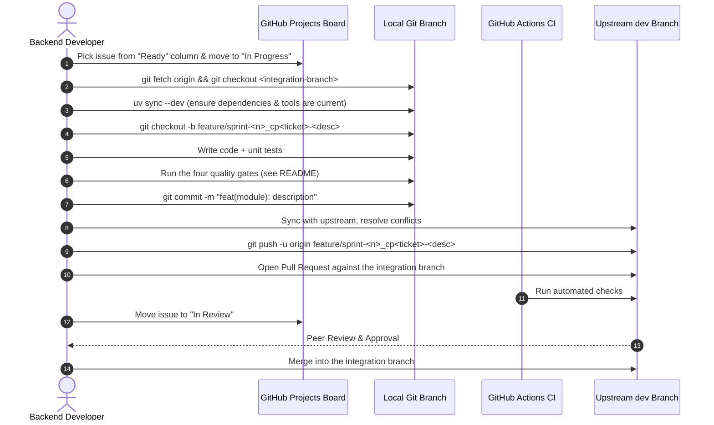

# Contributing to BRB Server (`brb-server`)

Welcome to the backend repository of **BRB (Borrow, Return, Borrow)**! This guide establishes the development workflow, coding conventions, architectural patterns, and quality standards for our backend engineering team.

Please read this document thoroughly before opening your first pull request. The mobile application team maintains its companion guide in the client repository.

| Role | Responsibilities |
|---|---|
| **Backend Developers** | Django REST Framework API, database models, migrations, background jobs, serializers, services, and automated tests in `brb-server` |
| **Mobile Developers** | React Native + Expo mobile client, client state management, UI/UX screens, in-app polling |
| **Admin Portal Maintainers** | Django Admin customizations, moderation queues, identity verification views, audit logging |
| **Product Owner & Course Instructor** | Backlog prioritization, SRS alignment, final code reviews, and production releases to `main` (Instructor: Mr. Chris Nicole F. Piamonte) |

Project tracking and sprint boards are managed under the [pup-swe-team GitHub Organization](https://github.com/pup-swe-team).

---

## Which document do I need?

Setup and running instructions live in exactly one place. This guide does not
repeat them.

| I want to… | Read |
|---|---|
| Install, configure, run, test, or debug the project | **[`README.md`](README.md)** — the only place setup is documented |
| Understand a decision and why it was made | [`docs/DECISIONS.md`](docs/DECISIONS.md) |
| See the data model | [`docs/COPUP_ERD.md`](docs/COPUP_ERD.md) |
| See what a sprint ticket requires | [`docs/BRB_BACKEND_SPRINTS.md`](docs/BRB_BACKEND_SPRINTS.md) |
| Know how this team branches, commits, and reviews | **This file** |
| Know the SRS domain rules we cannot break | **This file** §5.3 |

> **If setup steps change, change them in `README.md` only.** This file used to
> carry its own copy of the setup guide, and the two copies drifted apart — it
> went on instructing people to configure Cloudinary after Cloudinary was
> deleted. Keeping setup in one place is what stops that recurring.

---

## Contents

1. [Daily Development Workflow](#1-daily-development-workflow)
2. [Branches and Commits](#2-branches-and-commits)
3. [Code Quality: Ruff and Local Hooks](#3-code-quality-ruff-and-local-hooks)
4. [Continuous Integration (CI) and Quality Enforcement](#4-continuous-integration-ci-and-quality-enforcement)
5. [Coding Standards and BRB Architecture](#5-coding-standards-and-brb-architecture)
6. [Writing Issues and SRS Traceability](#6-writing-issues-and-srs-traceability)
7. [Definition of Ready and Done](#7-definition-of-ready-and-done)

Prerequisites, First-Time Setup and Troubleshooting were removed from this file
and now live in [`README.md`](README.md). AI assistants should read
[`AGENTS.md`](AGENTS.md) as well.

---

## 1. Daily Development Workflow

> Setup, tooling and troubleshooting are in [`README.md`](README.md). This
> section covers only the day-to-day loop.

Follow this step-by-step workflow for all contributions:



> **Ask the lead which branch to base your work on.** It is not always `dev`.
> During Sprint 1 the integration branch is `test/sprint-1_for-merging`, because
> CP-106 and CP-107 are still outstanding. `dev` currently holds no feature
> commits, so branching off it would silently discard your teammates' work.

1. **Pick an Issue**: Select an assigned issue from the **Ready** column on the board. Assign yourself and move it to **In Progress**.
2. **Sync Dependencies and Branch**:
   ```bash
   git fetch origin
   git checkout test/sprint-1_for-merging   # or dev, once it has been merged
   git pull origin test/sprint-1_for-merging
   uv sync --dev
   git checkout -b feature/sprint-3_cp504-handover-code
   ```
3. **Develop in Small Commits**: Write clean code backed by unit tests.
4. **Run the quality gates** — the exact commands live in
   [`README.md` §Quality gates](README.md#quality-gates). Run those four; they
   are deliberately not duplicated here.
5. **Migrations are never partial.** Always run the bare
   `uv run python manage.py migrate`, with no app labels. See §5.2.
6. **Commit Your Changes**: Follow Conventional Commits format:
   ```bash
   git add <changed-files>
   git commit -m "feat(orders): validate return authentication codes"
   ```
7. **Sync Upstream Changes**:
   ```bash
   git checkout test/sprint-1_for-merging
   git pull origin test/sprint-1_for-merging
   git checkout feature/sprint-3_cp504-handover-code
   git merge test/sprint-1_for-merging
   uv run python manage.py test
   ```
8. **Push and Open a PR**:
   ```bash
   git push -u origin feature/sprint-3_cp504-handover-code
   ```
   Open a PR targeting the same integration branch you branched from. In the PR
   description, link the issue using `Closes #XX`.
9. **Peer Review & CI Validation**: CI runs automated checks. Address peer
   review feedback with additional commits.
10. **Merge**: Once approved and all required checks pass, merge into the
    integration branch. Delete the feature branch afterwards.

---

## 2. Branches and Commits

### 2.1 Branch Naming Conventions
Branch names must be lowercase, hyphen-separated, and prefixed by category.

Every branch that does work on a sprint ticket carries **both** the sprint number and the ticket number, so a branch can be traced back to `docs/BRB_BACKEND_SPRINTS.md` without opening the tracker:

```
<category>/sprint-<n>_cp<ticket>-<short-description>
```

| Branch Pattern | Purpose | Example |
|---|---|---|
| `main` | Production release branch. Direct commits strictly prohibited. | `main` |
| `dev` | Active integration branch. Target of all PRs. Direct commits strictly prohibited. | `dev` |
| `feature/sprint-<n>_cp<ticket>-<desc>` | New feature development | `feature/sprint-1_cp102-email-verification` |
| `bugfix/sprint-<n>_cp<ticket>-<desc>` | Bug fix for code on `dev` | `bugfix/sprint-1_cp103-login-lockout` |
| `hotfix/sprint-<n>_cp<ticket>-<desc>` | Critical fix for code on `main` | `hotfix/sprint-1_cp102-verification-token` |
| `refactor/sprint-<n>_cp<ticket>-<desc>` | Code restructuring without behavior changes | `refactor/sprint-2_cp301-listing-filters` |
| `test/sprint-<n>_cp<ticket>-<desc>` | Test coverage improvements | `test/sprint-1_cp105-identity-documents` |

Rules for the ticket segment:

- Keep the `cp` prefix in lowercase and **do not zero-pad**: `cp102`, not `cp0102`. Ticket numbers reach four digits (e.g. `CP-1001`, `CP-1105`), so padding would make `cp1001` ambiguous to read.
- The `<short-description>` is 2–4 lowercase hyphenated words, in plain English. It is a label for humans scanning `git branch`, not a restatement of the ticket title.
- The ticket number identifies the ticket. The **domain** is expressed by the Conventional Commit **scope** (§4.2), not by the branch name — so branch names should not repeat the module.

#### Work with no ticket number
Some work has no CP ticket: infrastructure, dependency bumps, CI changes, documentation, or the pre-sprint setup pass. Use `no-ticket` in place of the ticket number so these branches stay self-describing and can be filtered out of ticket-scoped queries:

```
<category>/sprint-<n>_no-ticket-<desc>
```

| Example | Purpose |
|---|---|
| `feature/sprint-1_no-ticket-simplejwt-setup` | Prerequisite infrastructure with no ticket |
| `chore/sprint-0_no-ticket-dependency-bumps` | Maintenance outside any sprint (`sprint-0` = pre-sprint) |

### 2.2 Conventional Commits
All commit messages and PR titles must adhere to the **Conventional Commits** specification:

```
<type>(<scope>): <description>
```

#### Allowed Types
- **`feat`**: A new feature or API capability
- **`fix`**: A bug fix
- **`docs`**: Documentation updates only
- **`style`**: Formatting, whitespace, or linting fixes without code behavior changes
- **`refactor`**: Code reorganization that neither fixes a bug nor adds a feature
- **`perf`**: A performance improvement
- **`test`**: Adding, updating, or fixing automated tests
- **`chore`**: Build tools, dependency bumps, or repository configuration

#### Scopes (Tailored to BRB Domains)
Use the scope corresponding to the functional domain:
- `core`: Abstract base models (`TimeStampedModel`), platform-wide dynamic configuration (`SystemConfig`)
- `auth`: PUP webmail validation, registration, login, JWT issuance, password reset (housed in `apps/users`)
- `users`: Profiles, affiliations, deactivation, role switching
- `verify`: Identity document upload, verification review, consent management
- `listings`: Resource posting, categories, search, filters, availability dates
- `orders`: Borrow requests, approvals, cancellation, active orders, completions
- `codes`: Handover authentication codes, return authentication codes, rate limiting
- `disputes`: Damage reporting, missing parts, dispute cases, OSS/Campus Security escalation
- `chat`: One-to-one messaging, order-linked chat history, user blocking
- `notifications`: In-app event notifications, notification preferences, email delivery
- `reports`: Content/user reporting, 30-day auto-flagging, admin report queue
- `admin`: Admin dashboard, configuration parameters, pickup locations, metrics
- `audit`: Read-only administrator audit logging

#### Examples
- `feat(auth): validate student and faculty pup webmail domains`
- `fix(codes): prevent reused return codes after order completion`
- `test(orders): add unit tests for overlapping borrowing dates`
- `refactor(listings): extract availability filter into service layer`

---

## 3. Code Quality: Ruff and Local Hooks

Our project relies on **Ruff** for high-speed Python linting and code formatting, and local git hooks for rapid feedback before committing. The commands are listed in [`README.md` §Quality gates](README.md#quality-gates); the policy is below.

### 3.1 Ruff Linting and Formatting
Ruff provides two distinct capabilities: **linting** (`ruff check`) and **formatting** (`ruff format`).

| Tool Command | Purpose | What It Does |
|---|---|---|
| `uv run ruff check .` | **Linting** | Analyzes Python files for logical bugs, syntax errors, dead code, unused imports/variables, anti-patterns, and import ordering. |
| `uv run ruff check --fix .` | **Automated Fixes** | Automatically resolves lint violations that have safe, deterministic fixes (such as import sorting and dead variable removal). |
| `uv run ruff format .` | **Formatting** | Formats all Python source code to enforce uniform indentation, quoting, line breaks, and bracket styles across the repository. |
| `uv run ruff format --check .` | **Format Check** | Assesses whether any files require formatting without altering file content (used in CI environments). |

#### Resolving Violations and Reviewing Fixes
- **Fix, Do Not Ignore**: Ruff violations should normally be corrected directly in source code rather than suppressed or bypassed.
- **Review Automated Fixes**: While `uv run ruff check --fix .` is convenient, contributors must always review the resulting diff (e.g., using `git diff`) before staging or committing. Automated fixes can occasionally remove necessary side-effect code or alter code structure in unintended ways.
- **Accurate Terminology**: Ruff performs comprehensive Python linting and formatting (covering rules inspired by Flake8, isort, pyupgrade, and Black); avoid describing it as merely enforcing PEP 8.

#### Handling Intentional Exceptions in Django Code
Django applications occasionally require imports that appear unused to a static linter but are necessary for module initialization and runtime side effects (for example, importing signal receivers inside an app's `AppConfig.ready()` method, registering custom model fields, or importing models in an app initialization file).

- **Avoid Global Disabling**: **Do not broadly disable rules like `F401` (unused import)** project-wide or across entire files simply because the project is built with Django. Doing so masks legitimate dead code and import bugs.
- **Explicit Inline Exception**: When an import is legitimately required solely for its side effects, mark that specific line with an inline `# noqa: <rule>` comment and document why the exception is needed:

```python
# apps/users/apps.py
from django.apps import AppConfig


class UsersConfig(AppConfig):
    default_auto_field = "django.db.models.BigAutoField"
    name = "apps.users"

    def ready(self) -> None:
        from . import signals  # noqa: F401 - Required for signal receiver registration
```

---

### 3.2 Local Git Hooks and Pre-Commit
Pre-commit hooks provide fast local feedback on your machine before a commit is created, preventing unformatted or broken code from entering your local Git history.

- **Fast Local Feedback**: Running checks before committing allows you to detect formatting flaws, unresolved lint errors, and syntax issues immediately, without waiting for remote CI runs.
- **Not a Security or Repository-Enforcement Boundary**:
  - Local git hooks execute solely in the contributor's local environment.
  - Because any contributor can bypass local hooks at any time by running `git commit --no-verify`, **local hooks are not a security mechanism or repository-enforcement boundary**.
- **Guidance on Bypassing Hooks**:
  - Bypassing local hooks with `--no-verify` is discouraged during normal development because it bypasses early quality feedback and risks pushing flawed commits.
  - However, **bypassing a local hook does not inherently cause CI to fail**. CI evaluates the pushed code independently in a clean container; if the submitted code complies with all project standards, CI will pass regardless of whether local hooks were executed.
- **Configured Repository Hooks (`.pre-commit-config.yaml`)**:
  Pre-commit is managed in `pyproject.toml` (`pre-commit>=4.6.2`) and configured in `.pre-commit-config.yaml`. Install the hooks into your local Git repository clone:
  ```bash
  uv run pre-commit install
  ```
  To manually trigger all hooks across all files at any time:
  ```bash
  uv run pre-commit run --all-files
  ```
- **Configured Hooks & Rationale**:
  - `trailing-whitespace`: Automatically trims trailing spaces from line endings.
  - `end-of-file-fixer`: Enforces a single standard newline at the end of text files.
  - `check-yaml`: Validates the syntax of all YAML files.
  - `check-added-large-files`: Prevents accidental commits of large binary files (>500KB).
  - `detect-private-key`: Blocks accidental commits of private cryptographic keys.
  - `ruff` (`v0.6.9`, per `.pre-commit-config.yaml`): Checks staged Python files for lint errors and improper imports.
    - *Intentional Safety Design*: `args: [--fix]` is intentionally **omitted** so that Ruff never automatically deletes Django imports needed for runtime side effects (e.g., signal handlers or model registration).
    - *Migrations Excluded*: Excludes `^apps/.*/migrations/` so that auto-generated Django migration files are not flagged.
  - `ruff-format` (`v0.6.9`): Enforces consistent Python code formatting on staged files (excluding migrations).

> **The hook's Ruff and the project's Ruff are different versions.**
> `.pre-commit-config.yaml` pins its own isolated `ruff v0.6.9`, while
> `pyproject.toml` installs a much newer Ruff (0.16.x) for local and CI use.
> That is why `uv run ruff check .` can report rules the hook never sees. Run the
> project's own gates — the hook alone is not sufficient.
>
> `check-yaml` reports **Skipped** because the repository currently contains no
> YAML files. Harmless, and worth keeping for when CI config lands.

---

## 4. Continuous Integration (CI) and Quality Enforcement

Local checks give fast personal feedback; **GitHub Actions CI is the
authoritative verification platform** because it runs in a clean container.

### 4.1 What CI Actually Runs

`.github/workflows/ci.yaml` defines exactly two jobs. This is the complete
list — there is **no** commit-message or PR-title check, contrary to what an
earlier revision of this guide claimed.

| Job | Step | Purpose |
|---|---|---|
| `quality` | `uv run ruff format --check .` | Formatting is consistent |
| `quality` | `uv run ruff check .` | No lint errors |
| `test` | `uv run python manage.py makemigrations --check` | Models and migrations agree |
| `test` | `uv run python manage.py test` | Test suite passes (CI uses SQLite) |

Conventional Commits (§2.2) are therefore **enforced by peer review, not by
automation**. Nothing mechanically rejects a badly-named commit or PR title.

### 4.2 CI Only Runs on Some Branches

```yaml
on:
  pull_request:
    branches: [dev, main]
  push:
    branches: [dev, main]
```

A PR from `test/sprint-1_for-merging` — or any `feature/*` branch — triggers
**no CI run at all**. There is not even a pending "waiting for status" check,
because no statuses are produced. Practically:

- You cannot rely on CI to tell you a branch is green. Run the gates locally.
- Nothing mechanically blocks merging a broken branch, so reviewers must check.
- To get CI on every branch, change `branches:` to `- '**'`, or drop the key
  entirely (which defaults to all branches).

### 4.3 Merge Requirements and Branch Protection
It is essential to distinguish between workflow execution and repository merge enforcement:

- **Workflow vs. Branch Protection**: Simply defining or running a GitHub Actions workflow **does not automatically block pull requests from merging**.
- **Required Status Checks**: A failed CI check only becomes a strict, blocking merge barrier when repository administrators configure GitHub **Branch Protection Rules** or **Repository Rulesets** for target branches (`dev` and `main`) and designate specific jobs as **Required Status Checks**.
- **Intended Quality Standard**: Where branch protection rulesets are not yet configured or enforced in repository settings, all contributors and peer reviewers are expected to treat these checks as mandatory quality gates. Never approve or squash-merge a pull request that has failing test or lint runs.

---

## 5. Coding Standards and BRB Architecture

To maintain clarity, scalability, and maintainability across the team, all backend code must conform to the architectural guidelines below.

### 5.1 Django REST Framework Architecture
Organize features by modular Django apps:

```
brb_server/
├── brb_server/              # Project settings, root urls, WSGI/ASGI
├── apps/
│   ├── core/               # Abstract base models (TimeStampedModel), SystemConfig runtime parameters (FR14)
│   ├── users/              # Custom User model, PUP webmail auth, profiles, affiliations, identity verification (FR1-FR3, FR13)
│   ├── listings/           # Items, categories, availability calendar, pickup locations, listing photos (FR6-FR7)
│   ├── orders/             # Order lifecycle, status overrides, disputes & evidence, unreturned cases (FR8)
│   ├── codes/              # Handover & return OTP generation, status tracking, rate-limiting attempts (FR8, NFR 4.4)
│   ├── chat/               # 1-to-1 conversations, order-linked chat history, user blocking (FR10)
│   ├── reviews/            # Mutual 5-star ratings and written reviews (FR9)
│   ├── reports/            # Listing, user, review, and message reporting & auto-flagging (FR12)
│   ├── notifications/      # In-app event notifications, notification types (FR11)
│   └── audit/              # Read-only admin activity and document access logs (FR14, NFR 4.2)
```

#### Layered Responsibilities
- **`models.py`**: Clean database schemas with explicit constraints, field validations, and indexes. Keep business logic minimal.
- **`serializers.py`**: Validate incoming request payloads and serialize outgoing responses. Keep serializers focused on data translation.
- **`services.py` / `selectors.py`**: Encapsulate core business logic, complex database queries, atomic transactions, and transitions here.
- **`views.py` / `viewsets.py`**: Keep views thin. Views must only authenticate, check permissions, invoke services/selectors, and return standard HTTP responses.

### 5.2 Migrations are never partial

Always run the bare command:

```bash
uv run python manage.py migrate
```

**Never pass app labels.** Migrating a subset of apps is unsafe in this project,
and it fails in a way that does not look like a migration problem:

```
ProgrammingError: relation "listings" does not exist
```

CP-102's expiry sweep deletes unverified accounts, and Django's delete collector
walks *every* reverse relation on `User`. All the Sprint 2+ apps hold FKs to
`AUTH_USER_MODEL`, so with those tables missing, deleting a user crashes. This
was discovered the hard way, when the shared database was populated Sprint 1
only. Full rationale in `docs/DECISIONS.md` D-14.

A table existing is not the same as a feature being implemented. The Sprint 2+
tables are created and empty on purpose; the sprint boundary lives in what we
implement and test, not in which tables exist.

### 5.3 Non-Negotiable BRB Domain Rules (SRS Compliance)

#### 1. PUP Webmail Domain Validation (FR1, NFR 4.2)
- Registrations are strictly restricted to PUP webmail addresses:
  - Students: `@iskolarngbayan.pup.edu.ph`
   - Note: `Alumni` is **not** a supported affiliation (DECISIONS.md D-15). The
     enum is exactly `Student`, `Faculty`, `Staff`. Do not add it back.
  - Faculty and Staff: `@pup.edu.ph`
- All other domains must be rejected with a user-friendly error message.

#### 2. Dual-Role Permission Checks (FR4, FR5, NFR 4.2)
- A single account can act as both **Borrower** and **Lender**.
- **Rule**: Never evaluate permissions based on which UI dashboard view is currently open on the client. Validate the user's granted permissions and resource ownership on **every** backend endpoint.

#### 3. Identity Verification Privacy (FR3, NFR 4.2)
- ID pictures and supporting documents submitted during verification are strictly confidential.
- Stored in Postgres as `bytea` (`identity_documents.document_data`). **Cloudinary is removed** — never reintroduce external object storage for documents (D-13).
- Stored encrypted at rest using Fernet symmetric encryption (`IDENTITY_DOCUMENT_ENCRYPTION_KEY`, CP-107, D-18). Capped at 5 MB.
- **Accessible exclusively to Administrators**. Identity documents must never be served or exposed to Borrowers, Lenders, or unauthenticated users.
- Every administrative view, download, review, or contact release of an identity document automatically creates an immutable entry in the audit log with timestamp and IP address (`FR14`, CP-107).

#### 4. Handover & Return Authentication Codes (FR8, NFR 4.4)
- **Handover**: Generated for Lender $\rightarrow$ Borrower enters code in app to set order to `Active`.
- **Return**: Generated for Borrower $\rightarrow$ Lender enters code in app to confirm return.
- **Security Rules**:
  - Exactly 6 numeric digits.
  - Single-use and strictly time-limited.
  - Rate-limit code entry attempts. Temporarily lock code entry after repeated failed attempts to prevent brute-forcing.
  - Log every code generation, validation attempt, and failure.

#### 5. Zero In-Platform Monetary Processing (FR8, Section 1.2)
- Payment for rented items is negotiated and exchanged strictly outside the platform.
- **Prohibition**: The backend must **never** store, process, or record credit card numbers, GCash account details, or bank credentials.

#### 6. Scheduled Background Jobs Security (Section 2.4 & 5.2)
- Order status transitions for **Overdue** and **Unreturned** items are triggered by scheduled webhooks (e.g., `cron-job.org`).
- **Security Rule**: a scheduled endpoint must require a secret token in the `Authorization` header matching `CRON_SECRET_TOKEN`. Unauthenticated requests must be rejected with `401 Unauthorized`.
- **Fail closed**: if `CRON_SECRET_TOKEN` is unset on the server, the endpoint must return `503` and run nothing. Accepting every caller because one env var is missing turns a deployment mistake into an open endpoint.
- Accept the token bare or as `Bearer <token>`, since cron-job.org can be configured either way.
- **Existing endpoint**: `POST /api/v1/jobs/deactivate-unverified/` (CP-102, removes accounts that never confirmed their email). The `/jobs/check-overdue/` path named in the sprint doc belongs to CP-506 and does not exist yet. Both use the same shared secret and can share one cron schedule later.

#### 7. Read-Only Administrator Audit Logs (FR14, NFR 4.2)
- All administrative actions—approving/rejecting IDs, banning users, removing listings, viewing ID files, configuring parameters, and resolving disputes—must be recorded in a read-only audit log table.
- Audit log records must never be editable or deletable via the API or Admin UI.

#### 8. Timezone and Datetime Handling
- All database timestamps must be stored in UTC (`USE_TZ = True`).
- Convert to local Philippine Standard Time (PST / UTC+8) only when formatting representations for end users if required.

#### 9. Information Disclosure & Security
- When querying private resources belonging to another user, return `404 Not Found` rather than `403 Forbidden` to avoid leaking the existence of sensitive IDs.

---

## 6. Writing Issues and SRS Traceability

Every piece of work must be tracked as an issue on GitHub and traced back to the [SWE 2 | Group 3 - CoPUP (BRB SRS) - Google Docs](https://docs.google.com/document/d/19IqMZtnkvHDsBknI9umnIGfUrbnB-FxTYbEhW-_3rWE/edit?tab=t.xb7tp8rsiwyr).

### 6.1 Issue Titles and Prefixes
- **User Story**: `[US-XX] <User capability>` (e.g., `[US-04] Lender confirms item return with authentication code`)
- **Bug Fix**: `[BUG-XX] <Clear failure description>` (e.g., `[BUG-12] Expired borrow requests do not release calendar dates`)
- **Technical Task**: `[TASK-XX] <Imperative task statement>` (e.g., `[TASK-08] Setup DRF throttle classes for code verification`)

### 6.2 Labeling System
Every issue must carry at least three labels:
1. **`type:`**: `type:feature`, `type:bug`, `type:task`, `type:docs`
2. **`area:`**: `area:auth`, `area:listings`, `area:orders`, `area:codes`, `area:admin`
3. **`priority:`**: `priority:high`, `priority:medium`, `priority:low`

### 6.3 Issue Template Structure
```markdown
### SRS Traceability
- **Requirement Reference**: FR8 (Order Scheduling and Confirmation Sequence)
- **Non-Functional Requirement**: NFR 4.4 (Reliability)

### Description
As a verified Lender, I want to enter the Borrower's return code so that the item is recorded as Returned and the transaction concludes.

### Acceptance Criteria
- [ ] **AC-8.1**: Given a return code, When entered by the assigned Lender, Then order status changes from Active to Returned.
- [ ] **AC-8.2**: Given an expired or invalid code, When entered, Then the system increments the failed attempt counter and returns 400 Bad Request.
- [ ] **AC-8.3**: Given 5 consecutive failed code attempts, When entered, Then code verification is locked for 15 minutes.
```

---

## 7. Definition of Ready and Done

### Definition of Ready (DoR)
A task is **Ready to Start** when:
- [ ] The issue is linked to a parent Epic / SRS Functional Requirement (`FR1` - `FR14`).
- [ ] Clear acceptance criteria (`AC-X.Y`) with Given-When-Then statements are documented.
- [ ] Any UI or API schema dependencies from other teams are clarified.
- [ ] No unresolved blocking issues (`status:blocked`).

### Definition of Done (DoD)
A task is **Done** when:
- [ ] Every acceptance criterion is covered by automated unit/integration tests referencing the AC ID.
- [ ] Code passes all `ruff check` (linting) and `ruff format` (formatting) quality checks.
- [ ] Migrations are generated, tested, and backward-compatible.
- [ ] All automated CI checks pass cleanly on the pull request. *Note: CI only runs on `dev` and `main` (§4.2), so for a feature branch this means running the four gates locally.*
- [ ] At least one backend peer has approved the PR.
- [ ] The pull request is merged into the integration branch, and the linked issue is closed automatically.

---

## Need Further Help?
If you are blocked or have questions regarding architecture, database schemas, or SRS interpretation:
1. Check the [SWE 2 | Group 3 - CoPUP (BRB SRS) - Google Docs](https://docs.google.com/document/d/19IqMZtnkvHDsBknI9umnIGfUrbnB-FxTYbEhW-_3rWE/edit?tab=t.xb7tp8rsiwyr).
2. Comment directly on your issue or open a discussion thread in the team channel.
3. Tag the team lead or product owner for resolution.

Setup problems and error messages are covered in
[`README.md` §Troubleshooting](README.md#troubleshooting).
