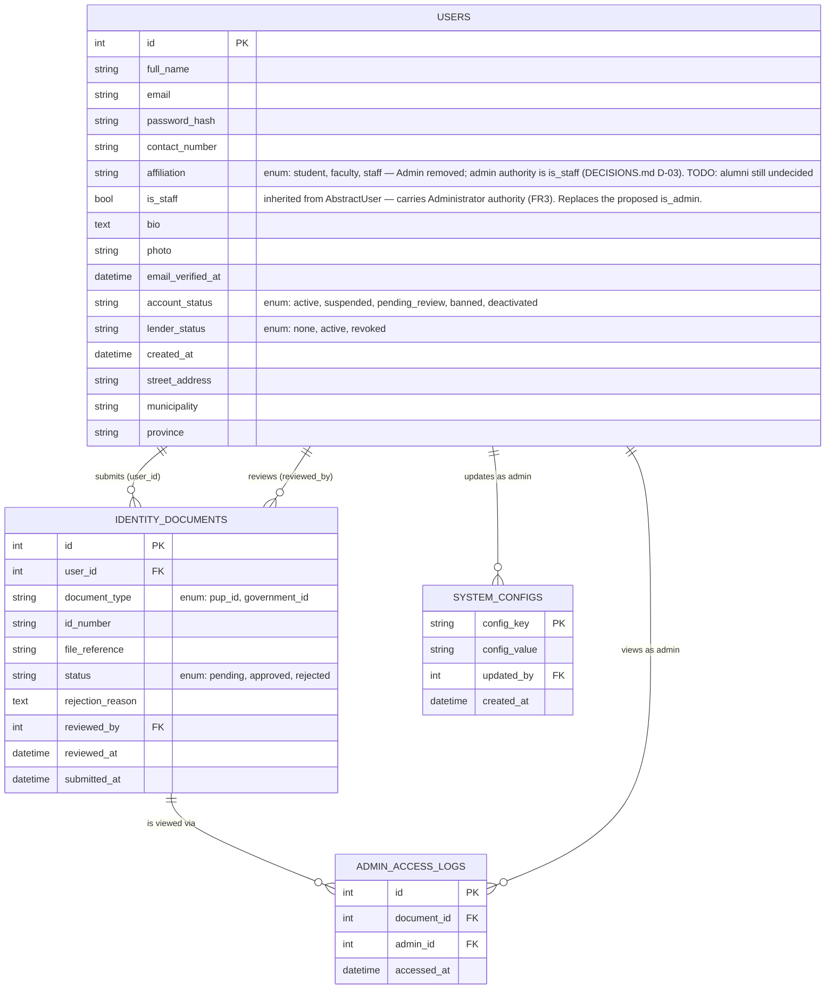
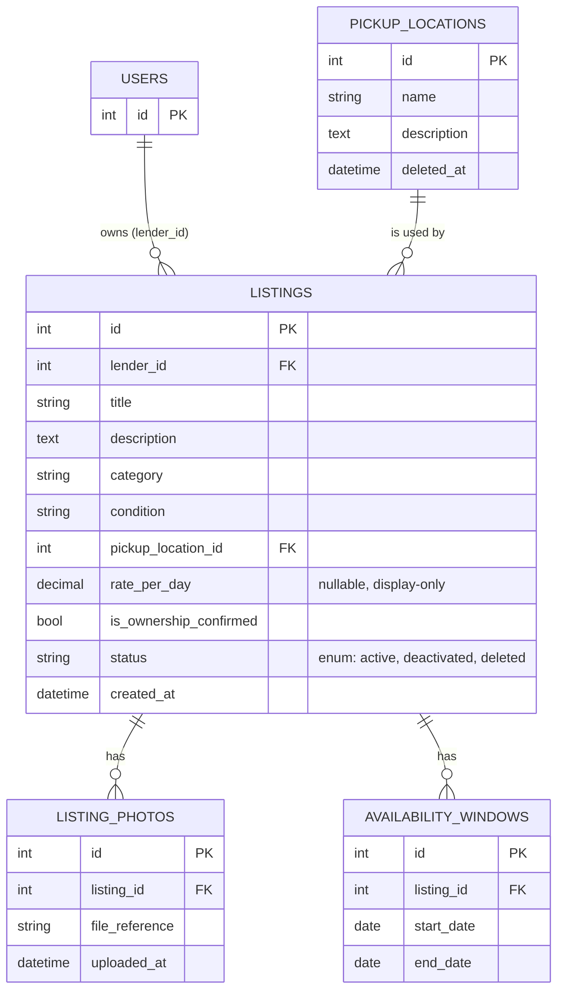
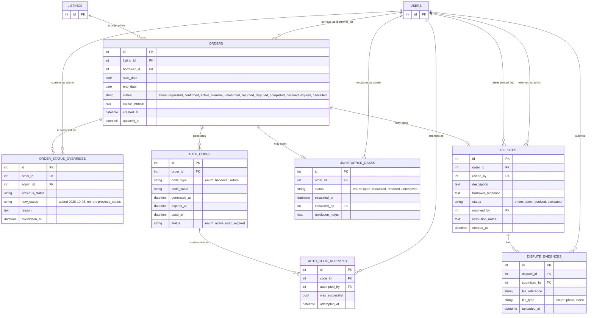
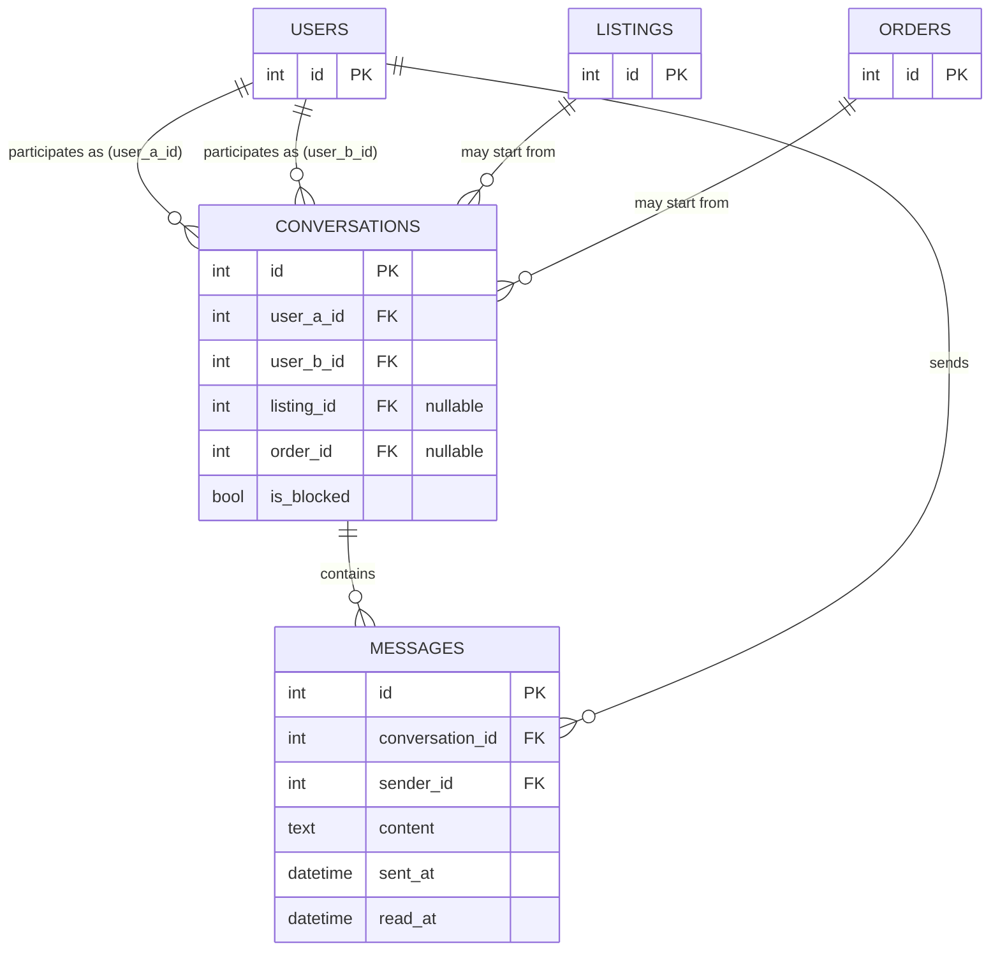
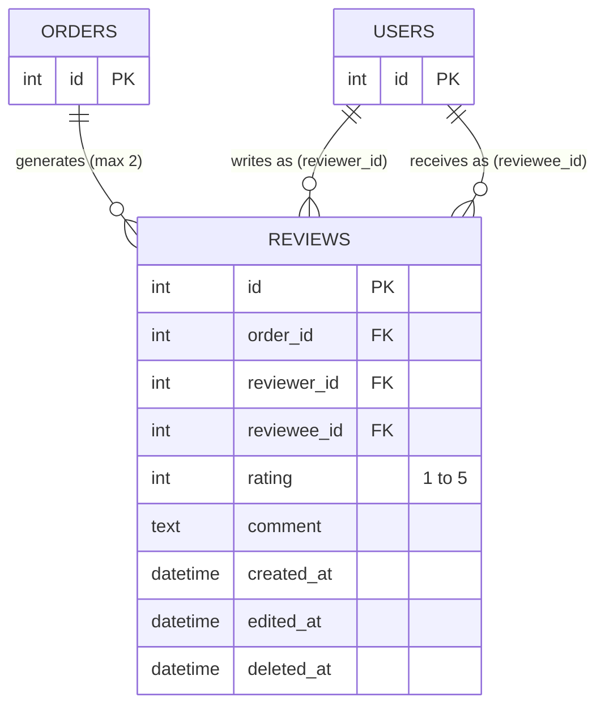
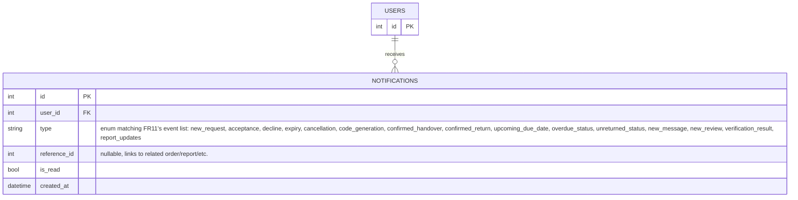

# BRB (Borrow, Return, Borrow) — Entity Relationship Diagram

**Master ERD (draw.io, source of truth for table layout):** `[PASTE SHARED DRAW.IO LINK HERE]`

Decisions that affect how these tables should be implemented (lookup tables
vs `TextChoices`, the admin flag, auth strategy) are recorded in `DECISIONS.md`.

This document defines the full database schema for BRB, organized into 7 logical
domains. The Django project implements them across 10 apps — see the app list
at the bottom of "Notes for implementation (Django)".

## ⚠ Open TODOs (as of latest Master ERD review)

These apply to the **draw.io Master ERD** and should be fixed there first; this
`.md` reflects them as inline notes so OpenCode and anyone reading this file
sees them too. See the "What to change in draw.io" list at the very bottom of
this document for exact field-level edits.

1. ~~`users.affiliation` enum still includes `Admin`~~ — **fixed differently
   than originally proposed.** `Admin` was removed from the enum, but instead
   of adding an `is_admin` boolean, administrator authority is carried by
   Django's built-in `is_staff`. See DECISIONS.md D-03 for the reasoning.
   `users` now inherits `is_staff`, `is_superuser` and the rest of
   `AbstractUser`'s columns, which this simplified diagram omits. draw.io
   should drop both the `Admin` enum value and the `is_admin` field.
2. ~~`reviews` is missing `reviewee_id`~~ — **fixed.** `Review.reviewee` now
   exists (`related_name="received_reviews"`), added in
   `reviews/migrations/0003_review_reviewee.py` together with a
   `review_reviewer_not_reviewee` check constraint.
3. ~~`order_status_overrides` is missing `new_status`~~ — **fixed.**
   `OrderStatusOverride.new_status` added in
   `orders/migrations/0003_orderstatusoverride_new_status.py`, matching the
   `CharField` type of `previous_status`.
4. ~~`disputes.status` enum values not confirmed~~ — **fixed.** Confirmed as
   `open, resolved, escalated` and now enforced by `Dispute.StatusChoices`
   (`orders/migrations/0004_alter_dispute_status.py`).
5. `user_municipalities` / `user_provinces` — confirm with the team whether
   this level of address normalization is actually needed, since the SRS only
   asks for a single "home address" field. **Still open.** The tables exist in
   the schema today; nothing has been removed.
6. **Not previously tracked:** the ERD lists `student, alumni, faculty, staff`
   for `affiliation`, but `Alumni` has never been implemented in the code, and
   student and alumni share the same email domain so they cannot be inferred
   from it. Needs a team decision — see DECISIONS.md.

Each domain is written as a [Mermaid](https://mermaid.js.org/syntax/entityRelationshipDiagram.html)
`erDiagram` block. Fields that are fixed state machines (not Admin-editable
lists) are modeled either as plain string columns with their valid values noted
in a comment (Django `TextChoices`) or as their own lookup table — the rule for
which applies is recorded in DECISIONS.md D-02.

Tables referenced from another domain (e.g. `users` referenced from `listings`)
appear as a minimal stub (PK only) in that domain's diagram, with a note
pointing to the domain where the full table is defined.

---

## 1. Accounts / Identity Domain

Full owner of the `users` table. Every other domain references `users` as a stub.

---

## 2. Listings / Catalog Domain

> `USERS` here is a **stub** — full schema lives in Domain 1 (Accounts).

---

## 3. Orders / Transaction Domain

> `USERS` and `LISTINGS` here are **stubs** — full schemas live in Domains 1 and 2.
> This is the highest-risk, most state-dependent domain (FR8).

---

## 4. Chat Domain

> `USERS`, `LISTINGS`, `ORDERS` here are **stubs** — full schemas live in
> Domains 1, 2, and 3.

---

## 5. Reviews Domain

> `USERS`, `ORDERS` here are **stubs** — full schemas live in Domains 1 and 3.

---

## 6. Reports / Moderation Domain

> `USERS`, `LISTINGS` here are **stubs**. `target_review_id` and
> `target_message_id` reference `REVIEWS` (Domain 5) and `MESSAGES` (Domain 4)
> respectively — add stub tables for those if rendering this diagram alone.

```mermaid
erDiagram
    USERS {
        int id PK
    }

    LISTINGS {
        int id PK
    }

    LISTING_REPORT_CATEGORIES {
        int id PK
        string name "prohibited, counterfeit, misleading_description, wrong_category, inappropriate_content"
    }

    LISTING_REPORTS {
        int id PK
        int reporter_id FK
        int target_listing_id FK
        int category_id FK
        text description
        string status "enum: open, resolved"
        datetime created_at
    }

    USER_REPORT_CATEGORIES {
        int id PK
        string name "scam_fraud, harassment, fake_account, spam, inappropriate_pfp"
    }

    USER_REPORTS {
        int id PK
        int reporter_id FK
        int target_user_id FK
        int category_id FK
        text description
        string status "enum: open, resolved"
        datetime created_at
    }

    REVIEW_REPORT_CATEGORIES {
        int id PK
        string name "fake_review, harassment, spam, offensive_content, irrelevant_review"
    }

    REVIEW_REPORTS {
        int id PK
        int reporter_id FK
        int target_review_id FK "references reviews.id in Domain 5"
        int category_id FK
        text description
        string status "enum: open, resolved"
        datetime created_at
    }

    MESSAGE_REPORT_CATEGORIES {
        int id PK
        string name "scam_fraud, harassment, spam, threats, inappropriate_content"
    }

    MESSAGE_REPORTS {
        int id PK
        int reporter_id FK
        int target_message_id FK "references messages.id in Domain 4"
        int category_id FK
        text description
        string status "enum: open, resolved"
        datetime created_at
    }

    USERS ||--o{ LISTING_REPORTS : files
    LISTINGS ||--o{ LISTING_REPORTS : "is target of"
    LISTING_REPORT_CATEGORIES ||--o{ LISTING_REPORTS : categorizes

    USERS ||--o{ USER_REPORTS : "files (reporter_id)"
    USERS ||--o{ USER_REPORTS : "is target of (target_user_id)"
    USER_REPORT_CATEGORIES ||--o{ USER_REPORTS : categorizes

    USERS ||--o{ REVIEW_REPORTS : files
    REVIEW_REPORT_CATEGORIES ||--o{ REVIEW_REPORTS : categorizes

    USERS ||--o{ MESSAGE_REPORTS : files
    MESSAGE_REPORT_CATEGORIES ||--o{ MESSAGE_REPORTS : categorizes
```

---

## 7. Notifications Domain

> `USERS` here is a **stub** — full schema lives in Domain 1.

---

## Notes for implementation (Django)

- **Team decision (supersedes the earlier guidance in this file):** lookup
  tables are used for state-machine fields, matching what the code already
  implements. Concretely:
  - Fields drawn as their own table in the diagrams below (`order_statuses`,
    `listing_statuses`, `auth_code_types`, `auth_code_statuses`,
    `identity_document_types`, `identity_document_statuses`,
    `unreturned_cases_statuses`, `file_types`) are real Django models with
    `db_table` names as shown.
  - Fields drawn as an inline `"enum: ..."` string **on a model the platform
    also needs to seed or validate inline** — `users.affiliation`,
    `users.account_status`, `users.lender_status`, `disputes.status` — are
    Django `TextChoices` classes on the model.
  - `*_report_categories` tables are real tables, Admin-managed per FR14.
- This mirrors the code as of the `test/aaron-scratch` branch. If you change
  one side, change the other in the same PR — the diagrams and the models are
  expected to stay in sync.
- `users.affiliation` does **not** include "Admin" — `Admin` was removed from
  the enum and administrator authority is carried by `users.is_staff`
  (inherited from `AbstractUser`). See DECISIONS.md D-03.
- `users` also inherits the rest of `AbstractUser` — `is_superuser`,
  `is_active`, `last_login`, `date_joined`, `password` — plus the M2M tables
  `users_groups` and `users_user_permissions`. None are drawn above because
  this is a simplified diagram; they do exist in the database.
- `users.affiliation` does **not** include "Alumni" either, even though the
  original enum in this diagram listed it. Undecided — see DECISIONS.md.
- Stub tables (PK-only boxes) in Domains 2–7 exist only so each diagram
  renders independently; they are not separate tables in the actual database.
  The real, full-column table is defined once, in its home domain.
- The diagrams use **7 logical domains**, but the Django project splits them
  across **10 apps**: `core`, `users`, `listings`, `orders`, `codes`, `chat`,
  `reviews`, `reports`, `notifications`, `audit`. `core` holds
  `system_configs`, `codes` holds `auth_codes`/`auth_code_attempts`, and
  `audit` holds `admin_access_logs` — all three of which appear inside a
  logical domain in the diagrams above.

---

## What to change in the draw.io Master ERD

Exact field-level edits needed, in priority order. Items 2–4 have already been
applied to the Django models; they still need to be mirrored in draw.io so the
Master ERD stops disagreeing with the code.

1. **`users` table** — **done in code, but the draw.io change differs from what
   this document originally asked for.** Do the following:
   - Remove `Admin` from the `affiliation` enum bracket, leaving
     `[Student, Faculty, Staff]`.
   - Do **not** add an `is_admin` field. Administrator authority is
     `users.is_staff` (inherited from `AbstractUser`). See DECISIONS.md D-03
     for why a separate `is_admin` was rejected.
   - Still undecided: whether to add `Alumni` to the enum.

2. **`reviews` table** — **done in code.** `reviewee_id` (Int, FK →
   `users.id`) now exists directly after `reviewer_id`. Mirror it in draw.io.

3. **`order_status_overrides` table** — **done in code.** `new_status` exists
   immediately after `previous_status`, same type. Mirror it in draw.io.

4. **`disputes` table** — **done in code.** The `status` enum is confirmed as
   `[open, resolved, escalated]` and enforced by `Dispute.StatusChoices`.
   Mirror the confirmed bracket in draw.io.

5. **`user_municipalities` / `user_provinces`** (team decision, not a fix)
   - If the team decides this level of detail isn't needed, remove both
     tables and the `municipality`/`province` FK fields on `users`, replacing
     them with the plain string fields already present
     (`street_address`, `municipality`, `province` as free text) — the SRS
     only specifies a single "home address," no cascading dropdowns.
   - If keeping it, no change needed, just confirm it's intentional.

Once these are fixed in draw.io, paste the diagram's shareable link at the
top of this document (replacing `[PASTE SHARED DRAW.IO LINK HERE]`) so this
`.md` and the Master ERD stay cross-referenced for OpenCode and the rest of
the team.
